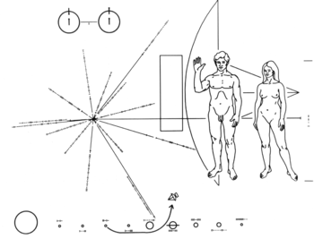
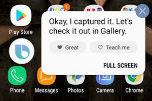
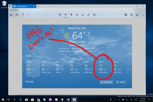
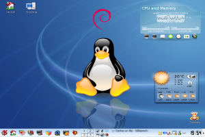

#  Project-name 

**punch line / ex: jQuery — The New volley game,the new JavaScript Wave**


## 🎀🎉🎊✨ 🚩 Intro
A short summary description of what this project is
`ex: simulation of 2D volleyball (arcade oriented), close to Java games of the same name.`
*(if the project name is an acronym or abbreviation, give full meaning)*

## 🖼️ screenshots:
  


##  📋 ℹ️ glossary
if necessary, a glossary could be written here
| Titre 1       |     Titre 2     |        Titre 3 |
| :------------ | :-------------: | -------------: |
| Colonne       |     Colonne     |        Colonne |
| Alignée à     |   Alignée au    |      Alignée à |
| Gauche        |     Centre      |         Droite |

## 📖 Description
long Description:
 - Who can be interested by this  project
 - explain how it work
 - the goal of this  project
 - what benefit from using this software

`ex: A match is played in 10 points and opposes 2 teams with 1 to 3 players each. A point is scored when a ball touches the ground on the other side of the net.`

> Blockquotes
> We're living the future so
> the present is our past.

[](contents/audio/siren.flac)

## ✔️ Features
- [x] Cross-platform (Linux, Mac, and Windows)
- [x] Support for many video, audio, and image formats (based on FFmpeg)
- [ ] Powerful curve-based Key frame animations
- [x] Desktop integration (drag and drop support)
- [ ] Unlimited tracks / layers
- [ ] Clip resizing, scaling, trimming, snapping, rotation, and cutting
- [x] Video transitions with real-time previews
- [x] Compositing, image overlays, watermarks
- [x] Title templates, title creation, sub-titles
- [x] 2D animation support (image sequences)
- [ ] 3D animated titles (and effects)
- [x] SVG friendly, to create and include vector titles and credits
- [x] Scrolling motion picture credits
- [x] Advanced Timeline (including Drag & drop, scrolling, panning, zooming, and snapping)
- [ ] Frame accuracy (step through each frame of video)
- [x] Time-mapping and speed changes on clips (slow/fast, forward/backward, etc...)
- [x] Audio mixing and editing
- [x] Digital video effects, including brightness, gamma, hue, greyscale, chroma key, and many more!


## 📝 Note:
extra notification memo
`ex: There can be 1 to 8 balls in play. As soon as a ball hits the ground, the set is finished and all the balls are put back into play. Each player has 4 keys, 2 keys of movement, a key allowing to jump and a key to change skin.You can not move in the air.`

## ⚠️ ⚡  Warnings
1. First ordered list item
2. Another item
    * Unordered sub-list
3. Actual numbers don't matter, just that it's a number
    * Unordered  sub-list
4. And another item.

##  🎓 ✍️ 👀 Tutorial
[](http://www.youtube.com/watch?v=YOUTUBE_VIDEO_ID_HERE)


## 🎓 ✍️ 👀 Examples
```javascript
function fancyAlert(arg) {
  if(arg) {
    $.facebox({div:'#foo'})
  }
}
```

## 🎓 ✍️ 👀 Samples
```python
def foo():
    if not bar:
        return True

s = "Python syntax highlighting"
print s
```

## 🗺️ map 
*uml source code plan* etc..
ex: you'll find the following directories and files:
```text
project/
└── docs/
    ├── languages/
    │   ├── english.md
    │   ├── frensh.md
    │   ├── dutch.md
    │   ├── arabic.md
    │   └── chinese.md
    └── .github/
        ├── readme.md
        ├── contributing.md
```
